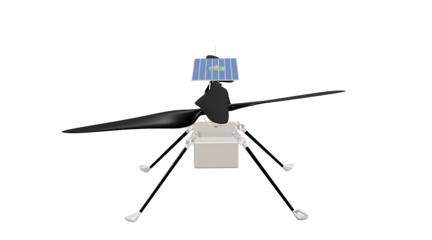

<!--  -->

  

<!--  -->

<!--Ingenuity Mars Helicopter, renderizado a partir do modelo de <a href="https://github.com/nasa-jpl/m2020-urdf-models">nasa-jpl/m2020-urdf-models</a>. Crédito: NASA/JPL-Caltech.-->
